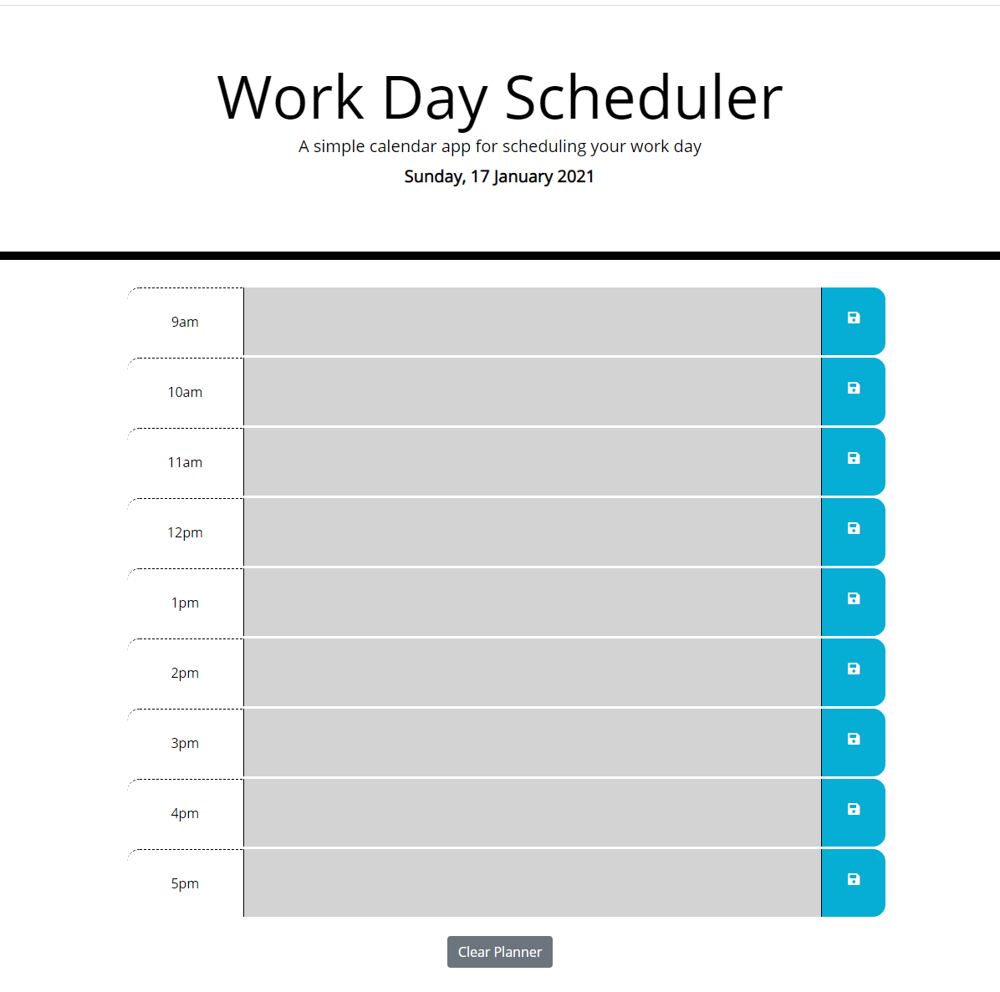

# Work Day Planer
Work Day Hourly Scheduler 

*   GitHub Repository [Work Day Planner](https://github.com/Loosekonnection/dayPlanner)
*   GitHub Pages URL [Work Day Planner Webpage](https://loosekonnection.github.io/dayPlanner/)
---

<br>

## Pseudo Code
<br>

*   The current day and date has to be dynamically apended to the header every day and time the webpage is opened.
*   A mechanism to obtain the date and time is required.

    *   Having read through the ```Moment.js``` website, I have chosen to use ```Luxon.js``` for this.

*   Hourly time slots horizontaly across the page are required to hold three columns:

    *   Column 1 - An hourly time slot (starting at 9am).
    *   Column 2 - A text input area to record user detail, task, meeting etc...
    *   Column 3 - A save button to store the text input within local storage.

*   The time displayed in column 1 is of 24hr format.
*   The active time slot needs be idenfied with an individual red colour, I will use a white font colour.
*   The past time slot will need to change to grey, I will also add a strike through on the text.
*   The future time slots will need to be green, I will use a black font colour for these slots.
*   The save icon is a white font awsome save icon that will need to have a hover over that enlargens the icon and changes the colour to black.
*   With timeslots having data stored in local storage, I will add a 'Clear Planner' button to clear local storage for the next day's use.
*   A HTML and CSS file with classes has been provided, classes need mapping.
---

<br>

## Technolgies Used

*   HMTL [w3schools.com Learn HTML](https://www.w3schools.com/html/default.asp)
*   CSS [w3schools.com Learn CSS](https://www.w3schools.com/css/default.asp)
*   JavaScript [w3schools.com JavaScript Tutorial](https://www.w3schools.com/js/default.asp)
*   jQuery [w3schools.com jQuery Tutorial](https://www.w3schools.com/jquery/default.asp)
---

<br>

## Using the Work Day Planner
<br>

*   The date in the banner automaitcally updates to the current day.

*   As the day progresses the current time colour (red) will automatically move down the page.

*   Simply enter your hourly event in the text area and then click the save icon to save the event for that hour.

*   To update or change a time slot, simply edit the text and click save to update.

*   To clear all events click the 'Clear Planner' button at the bottom of the page.

*   If your daily work hour schedule is not 9am to 5pm, this can be changed by updating the ```var htmlHourArray``` within the ```script.js```.

*   Inputting any of the daily hours in a 24hr format will add / update the timeblock to the page respectively.

<br>

```
var htmlHourArray = [9, 10, 11, 12, 13, 14, 15, 16, 17];
```

*   Currently the text input getItem is not dynamic and relies on hardcoding.

*   If you add extra hours to the ```htmlHourArray```, you will need to create a ```getItem``` and update the DOM via jQuery within the ```script.js``` file starting at line 90. 

*   example, change the number to suit the 24hr respectively.

```
var storedKey17 = localStorage.getItem("17");
$("#17").text(storedKey17);
```

<br>



---

<br>

## Credits

*   University of Birmingham [Coding Boot Camp](https://bootcamp.birmingham.ac.uk/coding/)
*   The Document Object Model [The Net Ninja](https://www.youtube.com/watch?v=wKBu_dEaF9E&list=PL4cUxeGkcC9haFPT7J25Q9GRB_ZkFrQAc&index=6)
*   DOM crash course with Brad Traversy [Traversy Media](https://www.youtube.com/watch?v=0ik6X4DJKCc&list=PLillGF-RfqbbnEGy3ROiLWk7JMCuSyQtX&index=2)
*   Most of the answers to my research on this project have come from [Stack Overflow](https://stackoverflow.com/).
*   For syntax help when finding a solution elsewhere [w3schools.com](https://www.w3schools.com/jsref/default.asp) is and has been a fantastic reference guide to use along with Stack Overflow.
*   Traversing the DOM with [jQuery](https://api.jquery.com/category/traversing/)

---
<br>


<br>

---
© 2021 Loosekonnection, Working towards being a Full Stack Developer, and feeling challange!
